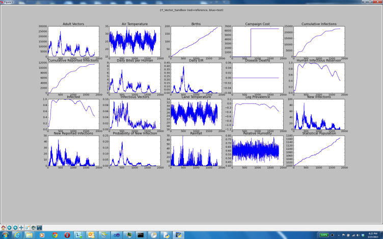

# Run regression tests

The Python script regression_test.py runs a suite of regression simulations and compares the output
to the reference output for each simulation. It is set up to run the simulations on an HPC cluster;
however, you can run modify the script to run tests locally. However, the script was written with
remote execution in mind and running it locally can be time-consuming. Running the entire regression
suite locally will take several hours on average.

The regression scenarios, script, configuration file, and other relevant files are all in the
[Regression](https://github.com/EMOD-Hub/EMOD/tree/main/Regression) directory. Be aware that many of these tests, due to abnormally high or low values, will
produce output that should not be considered scientifically accurate.

1.  Modify the configuration file, regression_test.cfg, for your environment, setting the values
    for the location of the working directory, input files, binary file, and cluster settings.

    - For local Windows simulations, set the values under [WINDOWS].
    - For local Ubuntu simulations, set the values under [POSIX]. Note that Ubuntu simulations
      are run locally by default and cannot be commissioned to an HPC cluster.
    - For simulations on IDM HPC clusters, no changes are necessary if your username and password
      are cached locally.
    - For simulations on your own HPC cluster, create [HPC-<cluster>] and [ENVIRONMENT-<cluster>]
      sections for your cluster that contain the same variables as shown for IDM HPC
      clusters.

1.  Select the suite of regression tests you want to run. This is indicated by a JSON file in the
    following format:

    ```json
    {
        "tests": [{
            "path": "Relative path to test directory."
        }, {
            "path": "Relative path to test directory."
        }]
    }
    ```

    You can use one of the JSON files in the Regression directory or create your own. The sanity.json
    file is recommended for quickly testing a wide range of EMOD functionality.

1.  From the Regression directory, open a Command Prompt window and run the regression test script,
    regression_test.py. It requires the name of the regression suite (without the .json extension)
    and the relative path to Eradication.exe. For example:

        regression_test.py sanity ..\Eradication\x64\Release\Eradication.exe

    In addition, you may need to include the following optional arguments depending on your
    testing environment or how Eradication.exe was built.

    | Argument | Default | Description |
    |----------|---------|-------------|
    | `--perf` | False | Measure Eradication.exe performance. |
    | `--hidegraphs` | False | Suppress pop-up graphs in case of validation failures. |
    | `--debug` | False | Use the debug path for EMODules. |
    | `--label` | | Add a custom suffix for HPC job name. |
    | `--config` | regression_test.cfg | The regression test configuration file. |
    | `--disable-schema-test` | True | Include to suppress schema testing, which is on by default. |
    | `--use-dlls` | False | Use EMODules when running tests. |
    | `--all-outputs` | False | Use all output JSON files for validation, not just InsetChart.json. |
    | `--dll-path` | | The path to the root directory of the EMODules to use. |
    | `--skip-emodule-check` | False | Skip checking if EMODules on the cluster are up-to-date, which can be slow. |
    | `--scons` | False | Indicate that this is a SCons build so custom DLLs are found in the build/64/Release directory. |
    | `--local` | False | Run all simulations locally. |

1.  Review the output and examine any failures.

    EMOD will output the standard error and logging files, StdErr.txt and StdOut.txt, produced from
    any simulation. For more information, see emod-generic:software-error-logging for generic,
    emodpy-hiv:emod/software-error-logging for HIV, or emodpy-malaria:emod/software-error-logging for malaria. In addition, regression_test.py will output time.txt
    under the regression test working directory and report_xxxx.xml under Regression/reports. The time
    report contains the EMOD version and total run time of the simulation. The regression report is
    in [JUnit](http://junit.org) standard form and captures run information, including pass/fail/complete and time to complete.

    If a simulation completes saying the run passed but the channel order was different than the
    reference output, this is considered a pass. However, if any output completes but does not match
    the reference output, this is considered a failure and a matplotlib chart of the output will
    appear in a pop-up window. The chart will appear immediately after the simulation, before the
    entire suite of regression tests completes. You can manipulate the output of the charts, such as
    adjusting the scale of the plots, zooming or panning, and so forth, through the icons at the
    bottom of the chart window.

    

If any of the regression tests fail and you have *not* made any changes to the EMOD source code,
email idmsupport@gatesfoundation.org.
